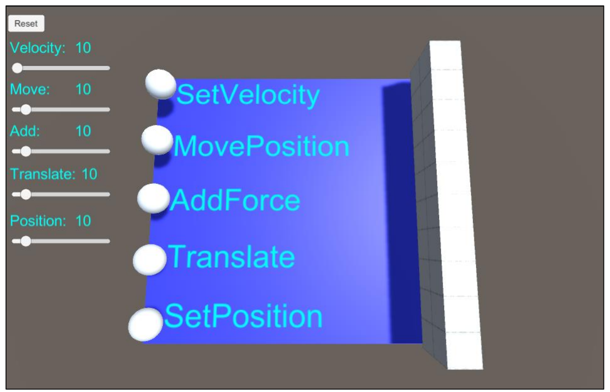

# Лабораторная работа №0

## по дисциплине "Программирование трёхмерной графики (часть 2)"

#### Задание:

Реализовать приложение, позволяющее опробовать разные способы перемещения.
Приложение должно содержать по одной сфере, начинающее перемещение одним из описанных выше
способов, при клике на неё кнопкой мыши. Скорости перемещения должны регулироваться при
помощи соответствующих элементов интерфейса.
Внешний вид требуемого приложения:

Результат: https://ptg-projects.github.io/Unity_Project_0/
